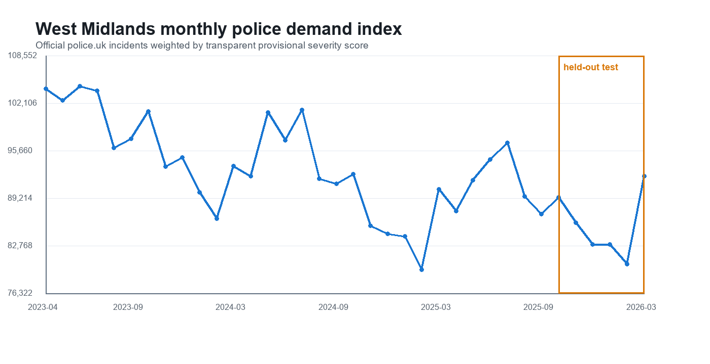
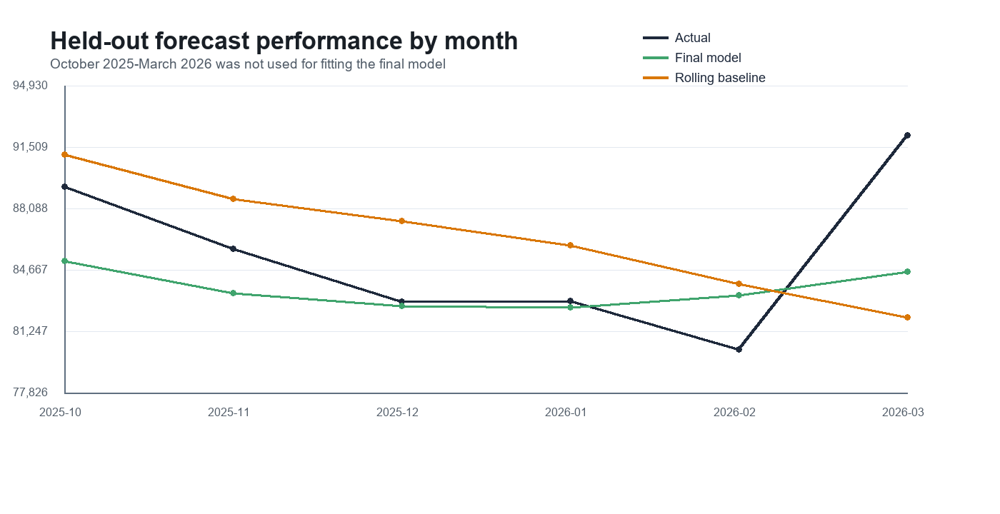
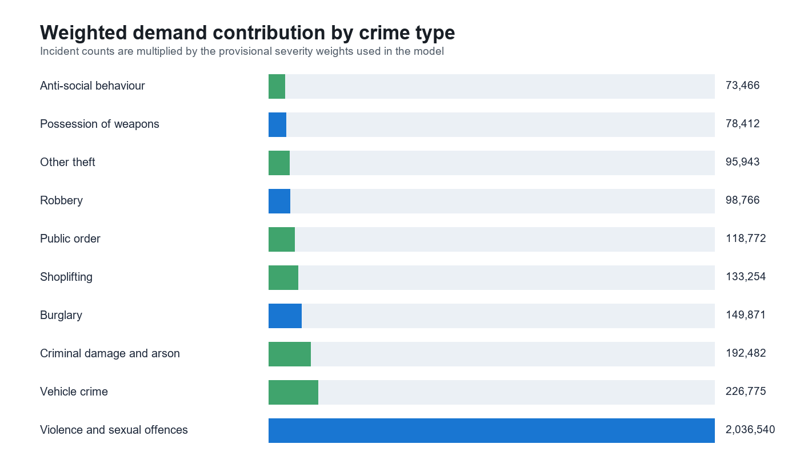
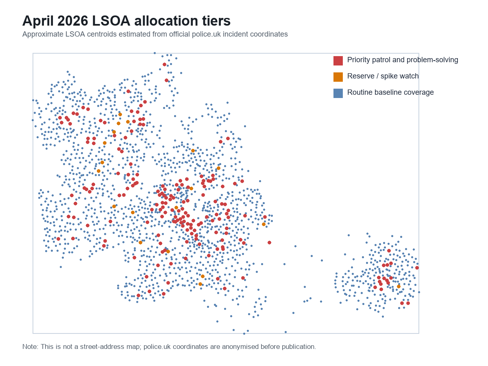

# Report: Initial police demand model

> The model is intentionally an initial pilot, not the final national recommendation. It gives a concrete technical foundation that can later be extended with severity literature, deprivation data, major events, weather or fairness checks.

## Overview

This model used official police.uk crime records for **West Midlands Police** from **April 2023 to March 2026**. The model converts monthly LSOA-level crime records into a weighted police demand index, forecasts next-month demand and translates the forecast into resource allocation tiers.

Main result for the April 2026 pilot forecast:

- Data used: 1011509 official police.uk crime records
- Geography: 1803 West Midlands LSOAs
- Time coverage: 36 months, April 2023 to March 2026
- Test period: October 2025 to March 2026
- Final model WAPE (Weighted Absolute Percentage Error): 28.4%
- Final model top-10% hotspot recall: 73.8%
- April 2026 priority LSOAs: 181
- April 2026 reserve / spike-watch LSOAs: 19
- Top 10% of LSOAs account for 33.5% of predicted weighted demand
- Top 20% of LSOAs account for 49.1% of predicted weighted demand


Basically, tthis model tries to connect those steps:

1. Estimate police demand from historical official crime data.
2. Forecast where demand is likely to be concentrated next month.
3. Translate the forecast into operational allocation tiers.
4. Keep assumptions transparent enough for non-technical stakeholders.
5. Identify limitations and potential ethical risks (not done)

## Folder structure

```text
modeling/initial_demand_model/
  README.md
  build_police_demand_model.py
  requirements.txt
  .gitignore
  data/
    README.md
  outputs/
    model_summary.json
    model_metrics.csv
    allocation_tier_summary.csv
    april_2026_lsoa_priority_forecast.csv
    crime_type_summary.csv
    monthly_force_summary.csv
    fig_monthly_demand.png
    fig_model_performance.png
    fig_crime_mix.png
    fig_allocation_map.png
```

The raw police.uk ZIP is not committed. See `data/README.md` for download instructions.

## Data source

The model uses real official UK public data only

- Source: https://data.police.uk/data/
- Publisher: Single Online Home National Digital Team / data.police.uk
- Data type: street-level crime CSVs
- Force: West Midlands Police
- Time range: April 2023 to March 2026
- Spatial unit: 2021 Lower Layer Super Output Area (LSOA)

Important data notes:

- police.uk coordinates are anonymised before publication (one of the limitations).
- The data records police-recorded crime, not all crime that occurred.
- The model currently uses crime records only, not calls for service, staffing, response time, outcomes, events or weather.

## Demand definition

Raw incident counts are easy to explain, but they treat all crime types as equally demanding. That is not realistic for police resource planning. A violent offence, a robbery and an anti-social behaviour record do not usually require the same level of police capacity.

For this first model, demand is defined as a severity-weighted index:

```text
Demand for one LSOA in one month
= sum of severity weights for all incidents in that LSOA-month
```

The provisional severity weights are:

| Crime type | Weight |
|---|---:|
| Violence and sexual offences | 5.0 |
| Robbery | 4.5 |
| Possession of weapons | 4.0 |
| Burglary | 3.0 |
| Vehicle crime | 2.5 |
| Criminal damage and arson | 2.5 |
| Public order | 2.0 |
| Drugs | 2.0 |
| Other crime | 2.0 |
| Theft from the person | 2.0 |
| Other theft | 1.5 |
| Shoplifting | 1.5 |
| Bicycle theft | 1.2 |
| Anti-social behaviour | 1.0 |

These weights are transparent but provisional. They are not official Home Office harm weights. **In the final project, we could either replace them with a literature-backed harm or cost framework, or justify them through policing literature and expert reasoning.**


## Model design

The target is next-month weighted demand for each LSOA.

The model uses lag and seasonality features:

- previous 1 month demand
- previous 2 months demand
- previous 3 months demand
- rolling 3-month average
- rolling 6-month average
- same month last year
- previous historical mean
- recent trend
- month-of-year seasonality terms

We compared three approaches:

1. Rolling 3-month baseline
2. Same-month-last-year baseline
3. Regularised lag model

The final model is a **regularised lag model** with validation-based calibration. Regularisation reduces overfitting. Calibration keeps the aggregate predicted demand closer to observed demand while preserving the LSOA ranking.


## Evaluation setup

The model was not evaluated on the same months used for fitting.

- Feature warm-up starts after lag variables become available.
- Training and validation period: October 2023 to September 2025
- Held-out test period: October 2025 to March 2026

Metrics:

- MAE: average absolute LSOA-month error in weighted demand points
- RMSE: error metric that penalises large misses more heavily
- WAPE: weighted absolute percentage error, easier to interpret at aggregate level
- Top-10% hotspot recall: how many actual top-decile LSOAs were recovered by the model

Model comparison:

| Model | WAPE | MAE | RMSE | *Top-10% hotspot recall |
|---|---:|---:|---:|---:|
| Rolling 3-month baseline | 30.5% | 14.5 | 20.6 | 72.4% |
| Same-month-last-year baseline | 38.6% | 18.3 | 26.2 | 62.2% |
| Final demand model | 28.4% | 13.5 | 19.6 | 73.8% |

explanation:

- The final model improves over the simple rolling baseline.
- The improvement is modest, which is useful to know early.
- The model is stronger for prioritising likely hotspots than for exact staffing numbers.
- The March 2026 increase is not fully captured, which suggests that future work could add event, calendar, weather or other variables (we could see this flaw in the below figure: *Model performance on the held-out period*).


## Main figures

### Monthly demand trend



### Model performance on the held-out period



### Weighted demand by crime type



### April 2026 allocation tiers



## Allocation logic

The April 2026 forecast is converted into three stakeholder-facing tiers.

| Tier | Meaning |
|---|---|
| Priority patrol and problem-solving | Top 10% of LSOAs by predicted weighted demand. These areas should be reviewed for proactive patrol, prevention and problem-solving capacity. |
| Reserve / spike watch | LSOAs with high predicted demand and at least 20% uplift compared with recent local history. These areas should receive flexible reserve attention and local intelligence checks. |
| Routine baseline coverage | Remaining LSOAs. These areas still require normal policing coverage, but are not the main target for extra proactive capacity in this pilot forecast. |

April 2026 tier summary:

| Tier | LSOAs | Share of predicted demand | Capacity units per 100 |
|---|---:|---:|---:|
| Priority patrol and problem-solving | 181 | 33.5% | 33.5 |
| Reserve / spike watch | 19 | 1.5% | 1.5 |
| Routine baseline coverage | 1,603 | 65.0% | 65.0 |

The "capacity units per 100" column is a simple way to communicate proportional allocation. If a police force had 100 flexible proactive capacity units for this forecast, the model would suggest roughly 33.5 units for priority LSOAs, 1.5 units for reserve/spike-watch LSOAs and 65.0 units for routine coverage. This is not the same as officer counts.

## Output files

| File | Purpose |
|---|---|
| `outputs/model_summary.json` | Compact summary of source, dataset size, model settings and headline findings. |
| `outputs/model_metrics.csv` | Held-out model comparison table. |
| `outputs/allocation_tier_summary.csv` | April 2026 summary by allocation tier. |
| `outputs/april_2026_lsoa_priority_forecast.csv` | Full LSOA-level April 2026 forecast and tier assignment. |
| `outputs/crime_type_summary.csv` | Crime type counts, weights and demand contribution. |
| `outputs/monthly_force_summary.csv` | West Midlands monthly total incidents and weighted demand. |
| `outputs/*.png` | Figures for presentation, report or dashboard prototype. |

## How to reproduce

1. Install Python dependencies:

```bash
pip install -r requirements.txt
```

2. Download the official police.uk ZIP as described in `data/README.md`.

3. Put the ZIP here:

```text
data/police_west_midlands_2023_04_to_2026_03.zip
```

4. Run:

```bash
python build_police_demand_model.py
```

Or run with a custom ZIP path:

```bash
python build_police_demand_model.py --zip-path path/to/police_uk_download.zip
```

5. The script writes updated CSV, JSON and PNG files to `outputs/`.

- 

## Limitations and ethical cautions

This model should not be used as an automatic deployment system.

limitations:

- It uses police-recorded crime, not all actual crime.
- Some crime types are underreported more than others.
- The severity weights are provisional.
- It does not yet include population, deprivation, calls for service, response times, available officers, events, weather or local intelligence.
- It predicts monthly demand, not daily or shift-level demand.
- The map uses approximate/anonymised police.uk coordinates and should not be interpreted as exact street locations.

Ethical:

- High predicted demand should not automatically mean more enforcement pressure.
- Allocation should include prevention, community support and problem-solving, not only patrol intensity.
- The model should be audited for fairness before being used in real recommendations.
- Stakeholders should be able to see the assumptions, weights and uncertainty.


## References

- data.police.uk. Data downloads. https://data.police.uk/data/
- data.police.uk. About the data and anonymisation. https://data.police.uk/about/
- College of Policing. What works in policing to reduce crime. https://www.college.police.uk/research/what-works-policing-reduce-crime
- Laufs, J., Bowers, K., Birks, D. and Johnson, S. D. (2021). Understanding the concept of demand in policing. Policing and Society, 31(8), 895-918.
